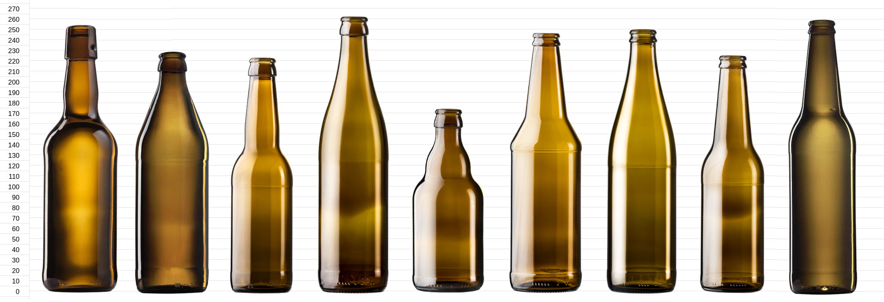

<!-- This is autogenerated file. Any changes should be done in templates/readme.md and rebuild by build.py -->

## A Multi-Attribute Dataset of Commercial Bottles for Computer Vision Research
> This repository is under continuous development.

This repository contains a curated dataset of high-resolution images of commercial beer bottles. Each image represents a controlled configuration of bottle attributes, including bottle type, glass color, fill level, liquid color, label presence, and cap state. Filenames follow a deterministic naming convention encoding these attributes, and the repository includes scripts for analyzing and validating the dataset.

The dataset is published as a versioned archive on Zenodo and assigned a DOI to ensure long-term accessibility, citability, and reproducibility. This GitHub repository complements the Zenodo record by providing code, documentation, and tools for working with the dataset.

### Zenodo DOI
Dataset Digital Object Identifier (DOI) is (...).

A stable DOI ensures that the dataset can be referenced in scientific publications. Each GitHub release can be linked to a Zenodo version, enabling precise citation of the dataset used in experiments.

### Authors
* [ Mateusz Jackowski](https://orcid.org/0000-0001-9109-3350)
* [ Krzysztof Rewak](https://orcid.org/0009-0003-6847-8318)
* [ Karol Zygadło](https://orcid.org/0009-0004-6384-825X)

### Repository Structure
```
bottles/
 ├─ images/           # All dataset images (not tracked in GitHub)
 ├─ scripts/          # Utility scripts for analysis and preprocessing
 │    └─ annotate.py  # Generates annotations
 │    └─ bottles.py   # Groups images by the physical bottle they show
 │    └─ build.py     # Validates files, builds readme and annotations
 │    └─ import.py    # Imports new images into dataset 
 │    └─ stats.py     # Computes dataset statistics
 │    └─ utils.py     # Helper functions for other scripts
 │    └─ validate.py  # Validates filenames of images
 ├─ annotations/      # Annotations JSON files
 ├─ readme.md         # You are here
 └─ licence.md
```

### Naming Convention
File naming follows the pattern:
```
{type}_{color}_{fill}_{liquid}_{label}_{cap}_{index}.{extension}
```

For example:
```
vichy_brown_filled_light_labeled_crowned_001.jpg
```

Each component corresponds to one categorical attribute of the bottle.

### Available Scripts
#### Builder
The `build.py` script provides a unified pipeline for maintaining the dataset and its accompanying documentation. It performs the following steps in a controlled sequence:
- validates the entire dataset structure using `scripts.validate`,
- generates updated dataset statistics by executing `scripts.stats`,
- injects these statistics into the project’s `readme.md` based on the template in `templates/readme.md`,
- regenerates annotation files using `scripts.annotate`.

The script stops automatically if validation fails, ensuring that no inconsistent or incomplete state is written to the repository.

Run with:
```
python -m scripts.build
```

#### Statistics
A handy script computes summary statistics for all images located in the `images/` directory. The script parses filenames according to the naming convention and prints:
- total number of images,
- distribution of each attribute,
- count of unique attribute combinations,
- any filenames that do not match the expected pattern.

Run with:
```
python -m scripts.stats
```

#### Validation
This script verifies the integrity and consistency of all images in the `images/` directory. It checks that filenames follow the expected naming convention, attributes match the allowed categories, and index numbering is correct within each attribute group.

The script reports:
- files with invalid or unparsable names,
- invalid attribute values,
- indexing issues such as missing indices or duplicates (per attribute group),
- detailed listings for all detected problems.

Run with:
```
python -m scripts.validate
```

The validator does not modify any files; it only reports inconsistencies.

#### Annotations
The annotation script creates a machine-readable JSON file describing all images in the dataset. It parses filenames according to the naming convention and extracts the full attribute set for each bottle. The resulting file provides a clean, structured representation of the dataset that can be used for further analysis, reproducibility, external tools, or downstream processing pipelines.

The generated annotation file contains, for each image:
- the filename and its extension,
- numerical index and group size,
- bottle type,
- glass color,
- fill level,
- liquid color,
- label presence,
- cap state.

Example in JSON format as follows:
```json
{
  "filename": "vichy_brown_filled_light_labeled_crowned_008.JPG",
  "extension": "jpg",
  "collection": {
    "index": 8,
    "of": 72
  },
  "parameters": {
    "type": "vichy",
    "color": "brown",
    "fill": "filled",
    "liquid": "light",
    "label": "labeled",
    "cap": "crowned"
  }
}
```

Annotations are written to `annotations/annotations.json`.

Run with:
```
python -m scripts.annotate
```

Only files that follow the expected naming scheme are included in the output. Files that cannot be parsed are skipped automatically.

#### Bottle index
Many images show the same physical bottle from different angles. Because the published
images carry no EXIF, `scripts.bottles` recovers that grouping from the index in each
filename: `import.py` consumes `metadata.csv` in camera order, so within one parameter
group the index preserves the order the photos were taken in, and the shots of a single
bottle form a contiguous block. The script finds where that sequence changes bottle by
comparing framing, background, and label colour between neighbouring images.

```
python -m scripts.bottles signatures   # one slow pass over images/, cached in .cache/
python -m scripts.bottles index        # writes annotations/bottles.json
python -m scripts.bottles report       # lists the groups and gaps worth reviewing
python -m scripts.bottles sheets       # contact sheets with the detected cuts drawn
```

Detection is a strong first pass, not ground truth: on three groups checked by hand it
found 6 of 7 real boundaries and added 4 false ones. Corrections belong in
`annotations/bottle_overrides.json`, keyed by group, and are re-applied on every run:

```json
{
  "amber_brown_empty_empty_labeled_crowned": {
    "verified": true,
    "cut_after": [46, 82, 100]
  },
  "euro_brown_overfilled_transparent_labeled_opened": {
    "cut_after": [45],
    "keep_together": [1]
  }
}
```

Each number is the index of the last image before a cut. `"verified": true` marks the
list as the whole truth for that group and turns detection off for it; otherwise
`cut_after` adds cuts and `keep_together` removes them.

##### Bottle identity across groups
A `bottle_id` only identifies a bottle inside its own parameter group. Because `label`
and `cap` are part of that group, one physical bottle photographed with its label on and
then off falls into two groups and gets two unrelated ids. Nothing visual joins them back
— the signature leans on the label, which is the very thing that changed — so the join is
recorded by hand as an `identity`, a name shared by every group the bottle appears in:

```json
{
  "amber_brown_empty_empty_labeled_crowned": {
    "verified": true,
    "cut_after": [46, 82, 100],
    "identity": ["porter", "piast", "kasztelan", "okocim"]
  },
  "euro_brown_overfilled_transparent_labeled_opened": {
    "verified": true,
    "cut_after": [45],
    "identity": ["mister_style", null]
  }
}
```

The list is positional: one name per bottle of the group, in index order, and it has to be
exactly as long as the group has bottles, so that a later cut cannot silently shift every
name onto the wrong bottle. `"identity": {"2": "piast"}` names a single bottle instead,
and `null` or a number left out leaves one unnamed. A name stands for one physical bottle
rather than a brand: two bottles of the same beer, shot separately, need two names.

`index` gathers the names into an `identities` block listing every `bottle_id` each bottle
was seen under, and `report` prints how many bottles are still unnamed.

The main use of this index is splitting the dataset: putting two shots of the same
bottle into different train and test folds leaks near-duplicates across the split. Group
by `identity` where it is set and by `bottle_id` everywhere else — a bottle known under
two ids would otherwise be split across the folds.

#### Testing
Run with:
```
pytest -q
```

### Dataset Statistics
```
Date: 2026-08-30
Total images: 5431

Attribute distributions:
- type:
  - tulip: 1043
  - amber: 794
  - longneck: 727
  - vichy: 543
  - euro: 493
  - nrw: 411
  - kormoran330: 327
  - steine: 313
  - ksiazece: 262
  - kormoran500: 240
  - bugel: 199
  - gundola: 79
- color:
  - brown: 4511
  - white: 553
  - green: 367
- fill:
  - filled: 2035
  - unfilled: 1329
  - overfilled: 1068
  - empty: 999
- liquid:
  - light: 2497
  - transparent: 1083
  - empty: 999
  - black: 431
  - dark: 421
- label:
  - labeled: 3825
  - unlabeled: 1606
- cap:
  - opened: 2800
  - crowned: 2631

File extensions:
  - jpg: 5431

Unique combinations: 334
  - vichy_brown_filled_light_labeled_crowned: 149
  - amber_brown_filled_light_labeled_opened: 129
  - amber_brown_filled_light_labeled_crowned: 118
  - amber_brown_empty_empty_labeled_crowned: 117
  - amber_brown_empty_empty_labeled_opened: 107
  - amber_brown_overfilled_light_labeled_crowned: 90
  - amber_brown_unfilled_light_labeled_opened: 83
  - amber_brown_overfilled_light_labeled_opened: 78
  - amber_brown_unfilled_light_labeled_crowned: 72
  - vichy_brown_unfilled_light_unlabeled_opened: 67
  - euro_brown_overfilled_transparent_labeled_opened: 57
  - vichy_brown_empty_empty_unlabeled_crowned: 55
  - longneck_green_filled_light_labeled_crowned: 45
  - longneck_green_filled_light_labeled_opened: 43
  - kormoran330_brown_unfilled_light_labeled_opened: 42
  - euro_brown_empty_empty_labeled_opened: 41
  - longneck_white_filled_light_labeled_crowned: 39
  - kormoran330_brown_filled_light_labeled_opened: 38
  - kormoran500_brown_filled_transparent_labeled_crowned: 38
  - tulip_brown_filled_light_unlabeled_crowned: 38
  - euro_brown_unfilled_transparent_labeled_opened: 37
  - vichy_brown_unfilled_transparent_labeled_opened: 37
  - kormoran330_brown_filled_light_labeled_crowned: 36
  - ksiazece_brown_empty_empty_labeled_crowned: 36
  - euro_brown_filled_transparent_labeled_opened: 35
  - ksiazece_brown_overfilled_light_labeled_opened: 35
  - ksiazece_brown_overfilled_light_labeled_crowned: 34
  - vichy_brown_overfilled_transparent_labeled_opened: 34
  - ksiazece_brown_unfilled_light_labeled_crowned: 33
  - ksiazece_brown_unfilled_light_labeled_opened: 33
  - tulip_brown_unfilled_black_labeled_crowned: 33
  - ksiazece_brown_filled_light_labeled_opened: 32
  - vichy_brown_filled_dark_labeled_crowned: 31
  - euro_brown_empty_empty_labeled_crowned: 30
  - ksiazece_brown_filled_light_labeled_crowned: 30
  - kormoran330_brown_unfilled_light_labeled_crowned: 29
  - ksiazece_brown_empty_empty_labeled_opened: 29
  - longneck_white_filled_light_labeled_opened: 29
  - tulip_brown_empty_empty_labeled_crowned: 29
  - vichy_brown_filled_light_labeled_opened: 29
  - kormoran330_brown_overfilled_light_labeled_crowned: 28
  - nrw_brown_filled_dark_labeled_crowned: 28
  - nrw_brown_filled_transparent_labeled_opened: 28
  - tulip_brown_empty_empty_unlabeled_opened: 28
  - tulip_brown_filled_transparent_unlabeled_opened: 28
  - vichy_brown_empty_empty_labeled_crowned: 28
  - euro_brown_unfilled_transparent_unlabeled_opened: 27
  - kormoran330_brown_overfilled_light_labeled_opened: 27
  - vichy_brown_filled_transparent_labeled_opened: 27
  - nrw_brown_unfilled_transparent_labeled_opened: 26
  - tulip_brown_filled_transparent_labeled_crowned: 26
  - tulip_brown_filled_transparent_unlabeled_crowned: 26
  - euro_brown_filled_black_labeled_crowned: 25
  - longneck_white_unfilled_light_labeled_opened: 25
  - kormoran330_brown_empty_empty_labeled_crowned: 24
  - steine_brown_filled_light_labeled_crowned: 24
  - tulip_brown_filled_light_labeled_opened: 24
  - tulip_brown_overfilled_transparent_labeled_crowned: 24
  - tulip_brown_unfilled_black_unlabeled_crowned: 24
  - tulip_brown_unfilled_dark_labeled_crowned: 24
  - tulip_white_filled_light_labeled_opened: 24
  - tulip_white_overfilled_transparent_labeled_opened: 24
  - euro_brown_filled_light_labeled_opened: 23
  - tulip_brown_empty_empty_labeled_opened: 23
  - tulip_brown_filled_transparent_labeled_opened: 23
  - kormoran500_brown_filled_light_labeled_opened: 22
  - longneck_white_overfilled_light_labeled_opened: 22
  - nrw_brown_empty_empty_labeled_opened: 22
  - tulip_brown_overfilled_transparent_labeled_opened: 22
  - tulip_brown_unfilled_light_labeled_opened: 22
  - longneck_brown_unfilled_light_labeled_crowned: 21
  - nrw_brown_overfilled_transparent_labeled_opened: 21
  - kormoran330_brown_empty_empty_labeled_opened: 20
  - kormoran500_brown_empty_empty_unlabeled_opened: 20
  - kormoran500_brown_filled_light_labeled_crowned: 20
  - tulip_white_empty_empty_labeled_crowned: 20
  - tulip_white_empty_empty_labeled_opened: 20
  - tulip_white_filled_transparent_labeled_opened: 20
  - tulip_white_overfilled_black_labeled_opened: 20
  - euro_brown_filled_light_labeled_crowned: 19
  - euro_brown_unfilled_light_labeled_crowned: 19
  - euro_brown_unfilled_light_labeled_opened: 19
  - kormoran500_brown_filled_transparent_labeled_opened: 19
  - longneck_white_unfilled_light_labeled_crowned: 19
  - steine_brown_empty_empty_labeled_crowned: 19
  - tulip_brown_empty_empty_unlabeled_crowned: 19
  - tulip_brown_filled_dark_unlabeled_crowned: 19
  - tulip_brown_overfilled_light_labeled_crowned: 19
  - longneck_brown_empty_empty_unlabeled_opened: 18
  - longneck_brown_filled_light_labeled_crowned: 18
  - longneck_white_overfilled_light_labeled_crowned: 18
  - tulip_brown_overfilled_light_labeled_opened: 18
  - tulip_brown_unfilled_dark_unlabeled_opened: 18
  - tulip_white_filled_light_labeled_crowned: 18
  - tulip_white_filled_transparent_labeled_crowned: 18
  - bugel_brown_filled_transparent_unlabeled_opened: 17
  - longneck_brown_overfilled_light_labeled_opened: 17
  - bugel_brown_unfilled_black_unlabeled_opened: 16
  - gundola_brown_unfilled_transparent_labeled_crowned: 16
  - kormoran500_brown_empty_empty_unlabeled_crowned: 16
  - longneck_brown_empty_empty_labeled_opened: 16
  - longneck_brown_overfilled_light_labeled_crowned: 16
  - longneck_green_unfilled_light_labeled_crowned: 16
  - tulip_white_overfilled_transparent_labeled_crowned: 16
  - euro_brown_overfilled_light_labeled_crowned: 15
  - gundola_brown_unfilled_transparent_labeled_opened: 15
  - kormoran330_brown_filled_light_unlabeled_crowned: 15
  - longneck_brown_empty_empty_labeled_crowned: 15
  - longneck_brown_empty_empty_unlabeled_crowned: 15
  - longneck_brown_filled_light_labeled_opened: 15
  - longneck_brown_filled_light_unlabeled_opened: 15
  - longneck_brown_filled_transparent_unlabeled_crowned: 15
  - tulip_brown_unfilled_dark_unlabeled_crowned: 15
  - tulip_white_filled_black_labeled_crowned: 15
  - tulip_white_unfilled_black_labeled_crowned: 15
  - vichy_brown_overfilled_transparent_unlabeled_opened: 15
  - bugel_brown_empty_empty_unlabeled_opened: 14
  - bugel_brown_filled_black_unlabeled_opened: 14
  - euro_brown_overfilled_light_labeled_opened: 14
  - kormoran330_brown_empty_empty_unlabeled_opened: 14
  - longneck_green_unfilled_transparent_labeled_crowned: 14
  - steine_green_empty_empty_labeled_crowned: 14
  - tulip_brown_filled_light_unlabeled_opened: 14
  - tulip_brown_unfilled_light_labeled_crowned: 14
  - vichy_brown_filled_transparent_unlabeled_opened: 14
  - bugel_brown_filled_light_unlabeled_opened: 13
  - bugel_brown_filled_transparent_unlabeled_crowned: 13
  - bugel_brown_unfilled_black_unlabeled_crowned: 13
  - euro_brown_unfilled_dark_labeled_opened: 13
  - kormoran500_brown_empty_empty_labeled_crowned: 13
  - kormoran500_brown_filled_light_unlabeled_crowned: 13
  - nrw_brown_unfilled_transparent_unlabeled_opened: 13
  - steine_brown_empty_empty_labeled_opened: 13
  - steine_brown_unfilled_transparent_labeled_crowned: 13
  - steine_green_empty_empty_labeled_opened: 13
  - steine_green_filled_light_labeled_opened: 13
  - tulip_brown_unfilled_dark_labeled_opened: 13
  - tulip_white_overfilled_black_unlabeled_opened: 13
  - vichy_brown_empty_empty_labeled_opened: 13
  - bugel_brown_filled_light_unlabeled_crowned: 12
  - gundola_brown_filled_transparent_labeled_opened: 12
  - longneck_brown_unfilled_light_labeled_opened: 12
  - longneck_brown_unfilled_light_unlabeled_opened: 12
  - longneck_green_filled_transparent_labeled_opened: 12
  - longneck_green_unfilled_transparent_labeled_opened: 12
  - tulip_white_filled_black_unlabeled_crowned: 12
  - tulip_white_filled_light_unlabeled_crowned: 12
  - tulip_white_unfilled_black_labeled_opened: 12
  - vichy_brown_unfilled_transparent_unlabeled_opened: 12
  - bugel_brown_filled_black_unlabeled_crowned: 11
  - bugel_brown_unfilled_dark_unlabeled_crowned: 11
  - euro_brown_filled_black_unlabeled_crowned: 11
  - euro_brown_filled_transparent_unlabeled_opened: 11
  - euro_brown_overfilled_transparent_unlabeled_opened: 11
  - kormoran330_brown_filled_light_unlabeled_opened: 11
  - kormoran500_brown_filled_light_unlabeled_opened: 11
  - longneck_green_filled_light_unlabeled_crowned: 11
  - longneck_green_unfilled_light_labeled_opened: 11
  - nrw_brown_filled_dark_labeled_opened: 11
  - nrw_brown_overfilled_dark_labeled_opened: 11
  - nrw_brown_overfilled_light_labeled_opened: 11
  - steine_green_filled_light_unlabeled_crowned: 11
  - steine_green_unfilled_light_unlabeled_crowned: 11
  - steine_green_unfilled_light_unlabeled_opened: 11
  - tulip_brown_overfilled_light_unlabeled_opened: 11
  - tulip_brown_unfilled_light_unlabeled_opened: 11
  - tulip_white_empty_empty_unlabeled_opened: 11
  - tulip_white_filled_black_unlabeled_opened: 11
  - tulip_white_overfilled_black_unlabeled_crowned: 11
  - tulip_white_unfilled_light_unlabeled_opened: 11
  - bugel_brown_overfilled_black_unlabeled_opened: 10
  - gundola_brown_filled_transparent_labeled_crowned: 10
  - kormoran330_brown_filled_transparent_unlabeled_crowned: 10
  - kormoran500_brown_filled_black_unlabeled_opened: 10
  - longneck_brown_filled_light_unlabeled_crowned: 10
  - longneck_brown_overfilled_light_unlabeled_crowned: 10
  - longneck_brown_overfilled_light_unlabeled_opened: 10
  - longneck_brown_unfilled_transparent_unlabeled_crowned: 10
  - longneck_green_filled_transparent_labeled_crowned: 10
  - nrw_brown_filled_light_labeled_crowned: 10
  - nrw_brown_unfilled_dark_labeled_opened: 10
  - steine_brown_unfilled_light_labeled_crowned: 10
  - steine_brown_unfilled_transparent_labeled_opened: 10
  - steine_green_filled_light_labeled_crowned: 10
  - tulip_brown_overfilled_dark_unlabeled_opened: 10
  - tulip_white_filled_black_labeled_opened: 10
  - tulip_white_filled_light_unlabeled_opened: 10
  - tulip_white_overfilled_light_labeled_opened: 10
  - tulip_white_overfilled_light_unlabeled_opened: 10
  - bugel_brown_filled_dark_unlabeled_crowned: 9
  - bugel_brown_overfilled_black_unlabeled_crowned: 9
  - bugel_brown_unfilled_transparent_unlabeled_opened: 9
  - euro_brown_filled_dark_unlabeled_crowned: 9
  - kormoran330_brown_empty_empty_unlabeled_crowned: 9
  - kormoran330_brown_unfilled_light_unlabeled_opened: 9
  - kormoran500_brown_unfilled_light_unlabeled_opened: 9
  - longneck_brown_filled_transparent_unlabeled_opened: 9
  - longneck_brown_unfilled_light_unlabeled_crowned: 9
  - longneck_green_empty_empty_labeled_opened: 9
  - longneck_green_overfilled_transparent_labeled_opened: 9
  - longneck_white_empty_empty_labeled_opened: 9
  - nrw_brown_filled_black_labeled_opened: 9
  - nrw_brown_filled_light_labeled_opened: 9
  - steine_brown_filled_light_labeled_opened: 9
  - steine_brown_filled_light_unlabeled_crowned: 9
  - steine_brown_filled_transparent_labeled_crowned: 9
  - steine_brown_overfilled_transparent_labeled_crowned: 9
  - steine_brown_unfilled_light_unlabeled_crowned: 9
  - tulip_brown_overfilled_light_unlabeled_crowned: 9
  - tulip_brown_unfilled_transparent_labeled_crowned: 9
  - tulip_brown_unfilled_transparent_labeled_opened: 9
  - tulip_white_empty_empty_unlabeled_crowned: 9
  - tulip_white_unfilled_transparent_labeled_crowned: 9
  - bugel_brown_unfilled_transparent_unlabeled_crowned: 8
  - euro_brown_overfilled_dark_unlabeled_opened: 8
  - euro_brown_unfilled_dark_unlabeled_crowned: 8
  - kormoran330_brown_filled_transparent_unlabeled_opened: 8
  - nrw_brown_filled_black_labeled_crowned: 8
  - nrw_brown_overfilled_black_labeled_crowned: 8
  - nrw_brown_overfilled_light_labeled_crowned: 8
  - nrw_brown_unfilled_light_labeled_opened: 8
  - nrw_brown_unfilled_light_unlabeled_crowned: 8
  - nrw_brown_unfilled_light_unlabeled_opened: 8
  - nrw_brown_unfilled_transparent_unlabeled_crowned: 8
  - steine_green_unfilled_light_labeled_crowned: 8
  - tulip_brown_filled_dark_unlabeled_opened: 8
  - vichy_brown_filled_transparent_unlabeled_crowned: 8
  - euro_brown_empty_empty_unlabeled_opened: 7
  - euro_brown_filled_dark_labeled_crowned: 7
  - euro_brown_overfilled_dark_labeled_opened: 7
  - euro_brown_unfilled_dark_labeled_crowned: 7
  - euro_brown_unfilled_dark_unlabeled_opened: 7
  - gundola_brown_empty_empty_labeled_crowned: 7
  - gundola_brown_empty_empty_labeled_opened: 7
  - gundola_brown_overfilled_transparent_labeled_opened: 7
  - kormoran330_brown_unfilled_light_unlabeled_crowned: 7
  - kormoran500_brown_overfilled_black_unlabeled_crowned: 7
  - kormoran500_brown_overfilled_black_unlabeled_opened: 7
  - kormoran500_brown_unfilled_black_unlabeled_crowned: 7
  - longneck_brown_overfilled_transparent_unlabeled_opened: 7
  - longneck_brown_unfilled_dark_unlabeled_crowned: 7
  - longneck_brown_unfilled_transparent_unlabeled_opened: 7
  - longneck_green_empty_empty_labeled_crowned: 7
  - longneck_green_filled_black_unlabeled_crowned: 7
  - longneck_green_filled_light_unlabeled_opened: 7
  - longneck_green_overfilled_black_unlabeled_opened: 7
  - longneck_green_overfilled_light_labeled_crowned: 7
  - longneck_green_overfilled_light_labeled_opened: 7
  - nrw_brown_empty_empty_unlabeled_crowned: 7
  - nrw_brown_empty_empty_unlabeled_opened: 7
  - nrw_brown_filled_light_unlabeled_crowned: 7
  - nrw_brown_filled_light_unlabeled_opened: 7
  - nrw_brown_filled_transparent_unlabeled_opened: 7
  - nrw_brown_overfilled_black_unlabeled_opened: 7
  - nrw_brown_overfilled_transparent_unlabeled_opened: 7
  - nrw_brown_unfilled_dark_labeled_crowned: 7
  - nrw_brown_unfilled_light_labeled_crowned: 7
  - steine_brown_empty_empty_unlabeled_opened: 7
  - steine_brown_overfilled_light_labeled_crowned: 7
  - steine_green_empty_empty_unlabeled_crowned: 7
  - steine_green_filled_light_unlabeled_opened: 7
  - tulip_brown_overfilled_dark_unlabeled_crowned: 7
  - tulip_white_overfilled_light_labeled_crowned: 7
  - vichy_brown_overfilled_transparent_unlabeled_crowned: 7
  - bugel_brown_filled_dark_unlabeled_opened: 6
  - euro_brown_empty_empty_unlabeled_crowned: 6
  - euro_brown_filled_dark_unlabeled_opened: 6
  - euro_brown_overfilled_dark_labeled_crowned: 6
  - kormoran500_brown_empty_empty_labeled_opened: 6
  - kormoran500_brown_unfilled_black_unlabeled_opened: 6
  - longneck_brown_unfilled_dark_unlabeled_opened: 6
  - longneck_green_overfilled_transparent_labeled_crowned: 6
  - nrw_brown_filled_dark_unlabeled_opened: 6
  - nrw_brown_filled_transparent_labeled_crowned: 6
  - nrw_brown_filled_transparent_unlabeled_crowned: 6
  - nrw_brown_overfilled_black_labeled_opened: 6
  - nrw_brown_overfilled_black_unlabeled_crowned: 6
  - nrw_brown_overfilled_dark_unlabeled_crowned: 6
  - nrw_brown_overfilled_dark_unlabeled_opened: 6
  - nrw_brown_overfilled_light_unlabeled_opened: 6
  - nrw_brown_unfilled_dark_unlabeled_opened: 6
  - steine_brown_empty_empty_unlabeled_crowned: 6
  - steine_brown_filled_light_unlabeled_opened: 6
  - steine_brown_filled_transparent_labeled_opened: 6
  - steine_brown_unfilled_light_unlabeled_opened: 6
  - steine_green_empty_empty_unlabeled_opened: 6
  - tulip_brown_filled_black_labeled_crowned: 6
  - tulip_brown_filled_black_labeled_opened: 6
  - tulip_brown_unfilled_transparent_unlabeled_crowned: 6
  - vichy_brown_empty_empty_unlabeled_opened: 6
  - bugel_brown_unfilled_dark_unlabeled_opened: 5
  - gundola_brown_overfilled_transparent_labeled_crowned: 5
  - kormoran500_brown_filled_black_unlabeled_crowned: 5
  - longneck_brown_overfilled_dark_unlabeled_crowned: 5
  - longneck_green_filled_black_unlabeled_opened: 5
  - longneck_white_filled_black_labeled_crowned: 5
  - longneck_white_filled_black_labeled_opened: 5
  - nrw_brown_filled_black_unlabeled_crowned: 5
  - nrw_brown_filled_black_unlabeled_opened: 5
  - nrw_brown_filled_dark_unlabeled_crowned: 5
  - nrw_brown_overfilled_transparent_unlabeled_crowned: 5
  - nrw_brown_unfilled_dark_unlabeled_crowned: 5
  - steine_brown_overfilled_light_labeled_opened: 5
  - steine_brown_overfilled_transparent_labeled_opened: 5
  - steine_brown_unfilled_light_labeled_opened: 5
  - steine_green_unfilled_light_labeled_opened: 5
  - tulip_brown_overfilled_dark_labeled_crowned: 5
  - tulip_brown_unfilled_light_unlabeled_crowned: 5
  - tulip_brown_unfilled_transparent_unlabeled_opened: 5
  - tulip_white_unfilled_black_unlabeled_opened: 5
  - tulip_white_unfilled_transparent_labeled_opened: 5
  - vichy_brown_unfilled_dark_unlabeled_crowned: 5
  - bugel_brown_overfilled_dark_unlabeled_crowned: 4
  - euro_brown_filled_dark_labeled_opened: 4
  - euro_brown_overfilled_dark_unlabeled_crowned: 4
  - kormoran500_brown_overfilled_light_unlabeled_crowned: 4
  - kormoran500_brown_unfilled_light_unlabeled_crowned: 4
  - longneck_brown_filled_dark_unlabeled_crowned: 4
  - longneck_brown_filled_dark_unlabeled_opened: 4
  - longneck_brown_overfilled_dark_unlabeled_opened: 4
  - longneck_brown_overfilled_transparent_unlabeled_crowned: 4
  - nrw_brown_overfilled_light_unlabeled_crowned: 4
  - steine_brown_overfilled_light_unlabeled_crowned: 4
  - steine_green_overfilled_light_labeled_crowned: 4
  - tulip_brown_filled_dark_labeled_crowned: 4
  - tulip_brown_filled_dark_labeled_opened: 4
  - tulip_white_unfilled_black_unlabeled_crowned: 4
  - bugel_brown_empty_empty_labeled_crowned: 3
  - kormoran500_brown_overfilled_light_unlabeled_opened: 3
  - tulip_brown_overfilled_dark_labeled_opened: 3
  - vichy_brown_overfilled_dark_unlabeled_crowned: 3
  - vichy_brown_overfilled_light_unlabeled_crowned: 3
  - bugel_brown_empty_empty_unlabeled_crowned: 2
  - steine_green_overfilled_light_labeled_opened: 2
```

#### Bottle types
  - amber: https://katalog.vetropack.com/catalogue/detail/18593
  - bugel: https://katalog.vetropack.com/catalogue/detail/26821
  - euro: https://katalog.vetropack.com/catalogue/detail/16931
  - gundola: https://katalog.vetropack.com/catalogue/detail/31806
  - kormoran330: custom bottle
  - kormoran500: custom bottle
  - ksiazece: custom bottle
  - longneck: https://katalog.vetropack.com/catalogue/detail/36950
  - nrw: https://katalog.vetropack.com/catalogue/detail/31782
  - steine: https://katalog.vetropack.com/catalogue/detail/31470
  - tulip: https://katalog.vetropack.com/catalogue/detail/34120
  - vichy: https://katalog.vetropack.com/catalogue/detail/30525



Reference silhouettes of bottle types included in the dataset, shown to scale in millimetres. From left to right: bugel, euro, longneck, nrw, steine, tulip, vichy, gundola, and amber. The shapes are based on manufacturer specifications available on https://katalog.vetropack.com. Commercial bottle types specific to individual breweries are not included due to the lack of publicly available standardized specifications.

### Citation
If you use this dataset, please cite:
```
@dataset{rewak2026,
    author = {Rewak, Krzysztof and Zygadło, Karol and Jackowski, Mateusz},
    title = {A Multi-Attribute Dataset of Commercial Bottles},
    year = {2026},
    publisher = {Zenodo},
    doi = {10.5281/zenodo.0000000}
}
```

or 
```
@misc{rewak2026,
    author = {Rewak, Krzysztof and Zygadło, Karol and Jackowski, Mateusz},
    title = {A Multi-Attribute Dataset of Commercial Bottles},
    year = {2026},
    publisher = {Zenodo},
    doi = {10.5281/zenodo.0000000}
}
```

### License
For full details regarding dataset and code licensing, please refer to the [licence.md](licence.md) file included in this repository.

### Contact
For questions, corrections, or contributions, please open an issue or contact the authors.
